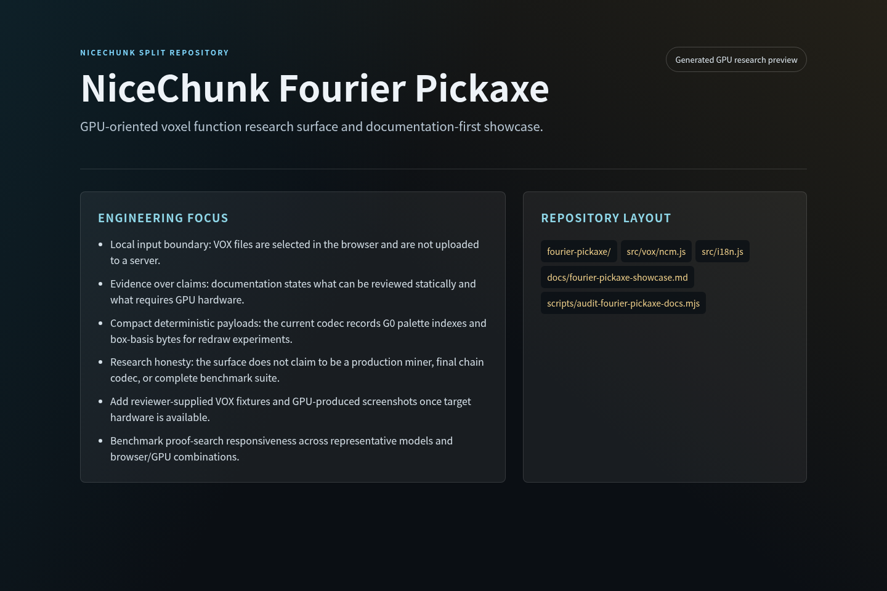

# NiceChunk Fourier Pickaxe

GPU-oriented voxel function research surface and documentation-first showcase.

## Project Overview

This repository contains Fourier Pickaxe, a NiceChunk research surface for compact voxel asset functions. It loads local MagicaVoxel files, maps colors into the shared G0 palette, merges voxels into deterministic basis functions, and redraws the model from compact function bytes.

The project is intentionally scoped as a GPU-oriented browser lab. It is useful for reviewing the asset-function idea, but CPU-only or headless environments should treat it as a documentation-only showcase rather than a runtime proof.

The repository is split from the main web client because voxel function research deserves a narrow review boundary. Reviewers can inspect the browser page, payload codec, proof-search preview, and documentation without scanning the full game client.

## System Principles

- Local input boundary: VOX files are selected in the browser and are not uploaded to a server.
- Evidence over claims: documentation states what can be reviewed statically and what requires GPU hardware.
- Compact deterministic payloads: the current codec records G0 palette indexes and box-basis bytes for redraw experiments.
- Research honesty: the surface does not claim to be a production miner, final chain codec, or complete benchmark suite.

## How It Works

- Open the Fourier Pickaxe page in a WebGL-capable browser with GPU acceleration enabled.
- Load a local .vox file, compute the function payload, and compare the source model against the function redraw.
- Use the proof-search preview as an exploratory model, not as production mining evidence.
- In CPU-only review environments, run the documentation audit and read the showcase document instead of claiming runtime validation.

## Why This Project Matters

NiceChunk needs a credible path from voxel assets to compact, inspectable payloads. Fourier Pickaxe makes that question visible as a concrete tool instead of a vague protocol idea.

A focused repository keeps this research auditable. External reviewers can verify the security boundary, GPU limitation, payload shape, and future work without depending on private assets or deployment infrastructure.

## Repository Layout

- `fourier-pickaxe/`
- `src/vox/ncm.js`
- `src/i18n.js`
- `docs/fourier-pickaxe-showcase.md`
- `scripts/audit-fourier-pickaxe-docs.mjs`

## Development Workflow

1. Clone the repository and inspect the focused source tree before changing shared contracts or generated artifacts.
2. Keep changes scoped to the domain of this repository. Cross-domain changes should be coordinated through the matching split repositories.
3. Run the smallest meaningful validation for the touched surface: build checks for programs, browser checks for pages, or fixture checks for deterministic libraries.
4. Update screenshots and documentation when behavior, visible UI, public constants, or developer-facing workflows change.

## Future Development Direction

- Add reviewer-supplied VOX fixtures and GPU-produced screenshots once target hardware is available.
- Benchmark proof-search responsiveness across representative models and browser/GPU combinations.
- Document codec compatibility rules before any on-chain storage commitment.
- Extract stable payload helpers into a reusable package if the research format matures.

## Maintenance Notes

This repository is a focused split from the main NiceChunk working tree. Keep the public surface explicit: avoid committing private keys, wallet files, deployment-only scripts, machine-specific configuration, or generated build artifacts. Runtime user-facing copy should stay behind the i18n layer where the project has an i18n surface.
